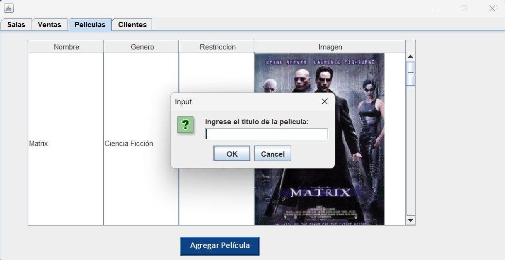

# Manual de Usuario — Proyecto POO

## Integrantes:

- Aidan Carrasco
- Uriel Dueñas
- Zenán Fernández
- Andrés Merino
- Josué Palma
- Mathew Verdezoto

## Índice

1. [Introducción](#introducción)
2. [Requisitos del Sistema](#requisitos-del-sistema)
3. [Instalación y Ejecución](#instalación-y-ejecución)
4. [Opciones Principales](#opciones-principales)
   - [1. Inicio de sesión (Login)](#inicio-de-sesión-login)
   - [2. Gestión de Salas](#gestión-de-salas)
   - [3. Gestión de Ventas](#gestión-de-ventas)
   - [4. Gestión de Películas](#gestión-de-películas)
   - [5. Gestión de Clientes](#gestión-de-clientes)
5. [Preguntas Frecuentes (FAQ)](#preguntas-frecuentes-faq)
6. [Contacto y Soporte](#contacto-y-soporte)

---

## Introducción

Se presenta el Cine, creado a partir del lenguaje Java utilizando el entorno NetBeans. Se construye un sistema el cual emula a la página web de un cine en general, teniendo como características principales la implementación de gestión de películas, gestión de clientes, gestión de salas, ventas e inicio de sesión, usando distintas herramientas para el desarrollo del GUI correspondiente y su parte lógica o codificación, todo desde una interfaz sencilla e intuitiva.

## Requisitos del Sistema

### Hardware

- Procesador: Intel Core i3 o equivalente
- Memoria RAM: 4gb mínimo

### Software

- Windows 10 o superior
- Linux (Ubuntu 18.04+, Fedora 30+)
- macOS 10.13 High Sierra o superior
- Java Development Kit (JDK) versión 11 o superior instalado y configurado en el PATH del sistema.
- Editor de texto o IDE recomendado: NetBeans, Eclipse, IntelliJ IDEA, VS Code (con soporte Java).

## Instalación y Ejecución

Para poder instalar y utilizar el Cine, se recomienda seguir los siguientes pasos:

### 1. Clonar el repositorio de GitHub

Abre un terminal en tu dispositivo y ejecuta el siguiente comando para que se descargue el proyecto en tu computadora de manera local.
```
git clone https://github.com/uriel-eio/Proyecto_POO.git
```

### 2. Verificar la versión de Java en tu dispositivo

Asegúrate de haber instalado Java JDK 11 o una versión superior.

```
java -version
```

En caso de no tenerlo instalado, puedes descargarlo desde el siguiente enlace:
[https://www.oracle.com/java/technologies/downloads/]

### 3. Abre tu IDE favorito y selecciona 'Open Project'

Para poder hacer uso del programa, dirígete a esta ruta en tu computador: C:\Users\[tu_usuario]\Proyecto_POO
En ella se encontrará el proyecto de la aplicación.

### 4. Ejecutar el proyecto

Luego de haber abierto el proyecto correctamente, busca la opción 'Run' en la barra de herramientas de tu editor de texto, en ella seleccionas la opción 'Run File o Run Project', posterior a ello podrás disfrutar de la aplicación sin problemas.

## Opciones Principales

En esta sección se describe cómo usar las principales funcionalidades del programa.

### Inicio de sesión (Login)

- **Descripción:**

Al momento de ejecutar el programa, se despliega la siguiente ventana la cual contiene dos casillas que deben ser rellenadas para que se pueda accerder a las opciones principales, es decir, iniciar sesión. A continuación el usuario y contraseña que debes ingresar:

Usuario: admin

Contraseña: admin


### Gestión de Salas

- **Descripción:**

En este apartado del programa, se permite visualizar los atributos de 3 salas predeterminadas del cine, junto a su capacidad, nombre, identificación y la película que está asignada a cada una de estas.
  
- **Pasos:**
  1. Dirigirse al apartado Salas a la izquierda superior de la Ventana, a continuación aparecerán las salas predeterminadas.

  2. En la parte izquierda inferior de la ventana, existe un recuadro donde se encuentran las películas disponibles al momento en el cine, seleccionar cualquiera de su preferencia.

  3. A continuación, hacer click en alguna de las 3 salas predeterminadas y presionar el boton "Cambiar", que se ubica en la parte inferior derecho de la Ventana.


¡Felicidades!, ha asignado con éxito una película a una sala predeterminada.

### Gestión de Ventas

- **Descripción:**
El usuario será presentado con una Ventana donde podrá seleccionar los asientos que desee para su compra en función de una sala.
  
- **Pasos:**
  1. Dirigirse a la pestaña Salas, ubicada a la izquierda superior de la Ventana, una vez ahi, hacer click en cualquiera de las 3 salas disponibles.

  2. Una vez realizado el paso anterior, dirigirse a la pestaña Ventas, donde se podrá encontrar un botón "Buscar asientos".

  3. A continuación, se desplegará una Ventana donde aparecerán los asientos disponibles dependiendo de la capacidad de la sala, aquí escoger los asientos que desee.

  4. Para confirmer la selección de los asientos, haga click en el botón "Confirmar Asientos", se desplegará un mensaje de confirmación y será enviado a la Ventana anterior.

  5. En caso de haber hecho click en el botón "Buscar asientos" sin querer, hacer click en el botón "Volver", este cerrará la Ventana donde se escogen los asientos y volverá a la Ventana anterior.

  6. Si deseas visualizar el estado de tu transacción después de haber confirmado los asientos, por favor selecciona el boton Mostrar Ventas.


### Gestión de Películas

- **Descripción:**

Se permite visualizar las películas en cartelera y sus características, tales como título, género, calificación y su portada.
  
- **Pasos para su uso:**
  1. Acceder al menú de Películas, en él se desplegarán los largometrajes que están en cartelera.

  2. En caso de querer agregar una nueva película, debes seleccionar el botón Agregar Película, en el introducirás los siguientes datos: nombre de la película, género, tiempo de duración en minutos, restricción de edad.

  3. Para finalizar la tarea de agregar una película, debes seleccionar una imagen para que sea la portada de la película; el programa te llevará directamente al explorador de archivos en donde deberás escoger una buena portada para tu película.


### Gestión de Clientes

- **Descripción:**

Esta sección del programa permite registrar nuevos clientes, actualizar su información, eliminar los registros y consultar el historial de las compras.
  
- **Pasos para su uso:**
  1. Selecciona la ventana Clientes.

  2. Si deseas registrar un nuevo cliente, selecciona el botón registrar e introduce los datos correspondientes: número de cédula, nombre, número de teléfono.

  3. En caso de requerir editar la información del cliente que registraste, debes seleccionar el botón modificar.


## Preguntas Frecuentes (FAQ)

- ¿Qué hacer si olvidé mi contraseña?

Actualmente, el sistema no cuenta con recuperación automática de contraseñas. Si eres administrador, puedes restablecer la contraseña desde la base de datos o contactando al desarrollador para soporte.

- ¿Cómo agregar una nueva película?

Ingresa al programa, dirígete a la sección “Gestión de Películas” y haz clic en “Agregar Película”. Completa los campos requeridos y selecciona la portada desde tu computador. Guarda la información para que la película se agregue a la cartelera.

- ¿Cómo consultar ventas realizadas?

Accede a la sección de “Gestión de Ventas” donde puedes visualizar el historial de ventas realizadas, filtrando por fechas, películas o clientes según tus necesidades.

- ¿El programa funciona en macOS/Linux?

Sí, el programa está desarrollado en Java, por lo que es compatible con macOS, Linux y Windows, siempre que tengas instalado Java 11 o superior.

## Contacto y Soporte

- Email de contacto: uriel.duenas@epn.edu.ec
- Enlace a issues en GitHub: [Reportar un Issue o solicitar soporte](https://github.com/uriel-eio/Proyecto_POO/issues)

---
